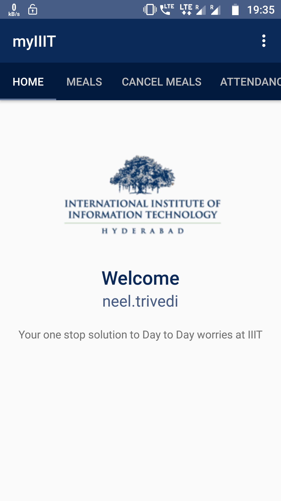
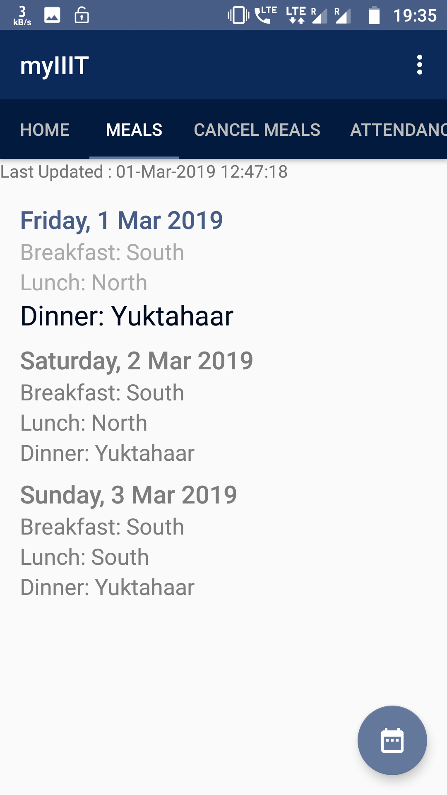
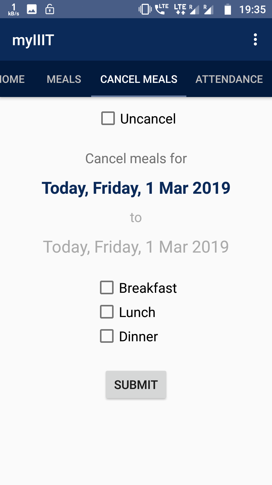
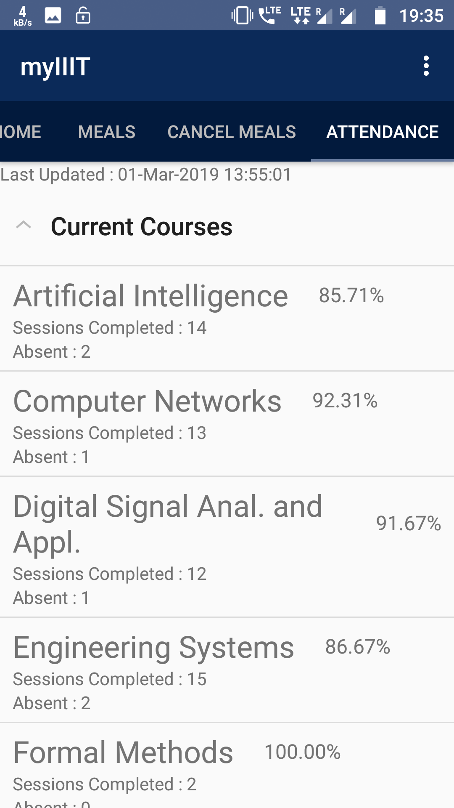

## myIIIT

##### A day to day use app for students at International Institute of Information Technology, Hyderabad

#### Features
- Students can see their mess registration for any month.
- Students can cancel their meals in single click
- Students can keep track of their attendance in current as well as past course

##### Upcoming Features
- Mess changing option
- Assignment deadline notificatios and submission
- Courier notifications

##### And all these without any need to logging into any VPN. This app works on any network removing the tiresome job of connecting to intranet everytime students want to check meals/attendance.

 
 
 
 
